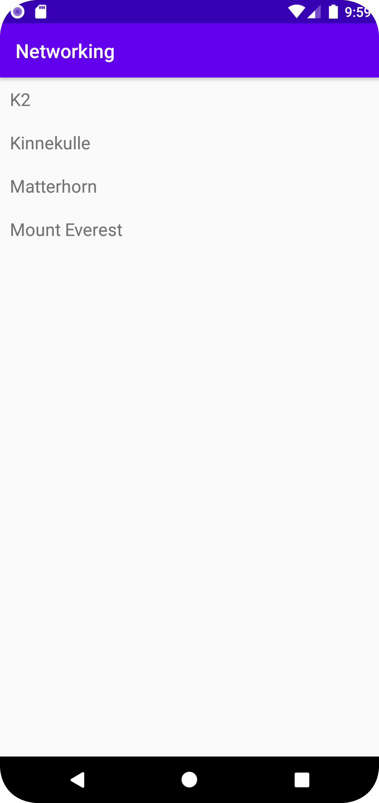

# Rapport

I denna uppgift skapades en RecyclerView med en tillhörande adapter i syfte att populera RecyclerViewn med data hämtat från ett JSON-objekt hämtat från en web service.
För att matcha objekten i JSON-objektet skapades klassen Mountain och sedan användes GSON för att parsea datan till Mountain-objekt. I XML-filerna skapades
en RecyclerView och ett custom RecyclerView_item, vilket är den view som bygger upp varje "rad" i recyclerviewn. Denna layouten innehåller endast en TextView.


MainActivity:
```
public class MainActivity extends AppCompatActivity implements JsonTask.JsonTaskListener {

    private final String JSON_URL = "https://mobprog.webug.se/json-api?login=brom";
    private final String JSON_FILE = "mountains.json";
    private ArrayList<Mountain> listOfMountains;
    RecyclerViewAdapter adapter;

    @Override
    protected void onCreate(Bundle savedInstanceState) {
        super.onCreate(savedInstanceState);
        setContentView(R.layout.activity_main);

        listOfMountains = new ArrayList<>();

         adapter = new RecyclerViewAdapter(this, listOfMountains, new RecyclerViewAdapter.OnClickListener() {
            @Override
            public void onClick(Mountain item) {
                Toast.makeText(MainActivity.this, item.info(), Toast.LENGTH_SHORT).show();

            }
        });

        new JsonTask(this).execute(JSON_URL);

        RecyclerView view = findViewById(R.id.recycler_view);
        view.setLayoutManager(new LinearLayoutManager(this));
        view.setAdapter(adapter);
    }

    @Override
    public void onPostExecute(String json) {

        Log.d("test", "berg " + json);
        Gson gson = new Gson();

        Type type = new TypeToken<List<Mountain>>() {}.getType();
        List<Mountain> listOfFetchedMountains = gson.fromJson(json, type);

        listOfMountains.addAll(listOfFetchedMountains);
        adapter.notifyDataSetChanged();
    }

}
```


RecyclerViewAdapter:

```package com.example.networking;

   import android.content.Context;
   import android.view.LayoutInflater;
   import android.view.View;
   import android.view.ViewGroup;
   import android.widget.TextView;

   import java.util.List;

   import androidx.annotation.NonNull;
   import androidx.recyclerview.widget.RecyclerView;

   public class RecyclerViewAdapter extends RecyclerView.Adapter<RecyclerViewAdapter.ViewHolder> {

       private List<Mountain> listOfMountains;
       private LayoutInflater layoutInflater;
       private OnClickListener onClickListener;

       RecyclerViewAdapter(Context context, List<Mountain> items, OnClickListener onClickListener) {
           this.layoutInflater = LayoutInflater.from(context);
           this.listOfMountains = items;
           this.onClickListener = onClickListener;
       }

       @Override
       @NonNull
       public ViewHolder onCreateViewHolder(@NonNull ViewGroup parent, int viewType) {
           return new ViewHolder(layoutInflater.inflate(R.layout.recyclerview_item, parent, false));
       }

       @Override
       public void onBindViewHolder(ViewHolder holder, int position) {
           holder.title.setText(listOfMountains.get(position).toString());
       }

       @Override
       public int getItemCount() {
           return listOfMountains.size();
       }

       public class ViewHolder extends RecyclerView.ViewHolder implements View.OnClickListener {
           TextView title;

           ViewHolder(View itemView) {
               super(itemView);
               itemView.setOnClickListener(this);
               title = itemView.findViewById(R.id.title);
           }

           @Override
           public void onClick(View view) {
               onClickListener.onClick(listOfMountains.get(getAdapterPosition()));
           }
       }

       public interface OnClickListener {
           void onClick(Mountain item);
       }
   }```



